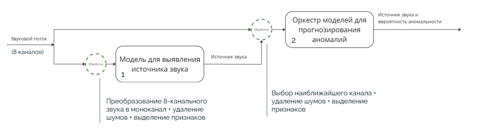
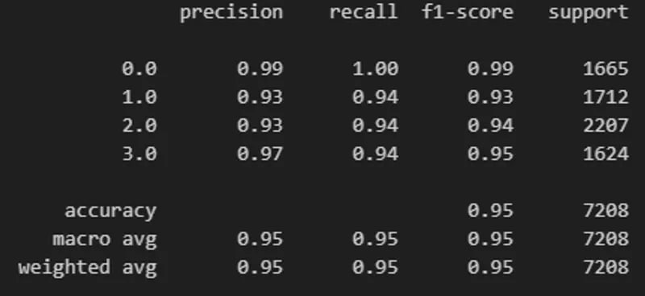
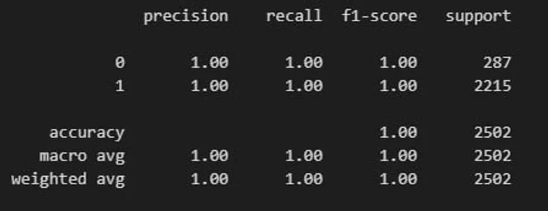
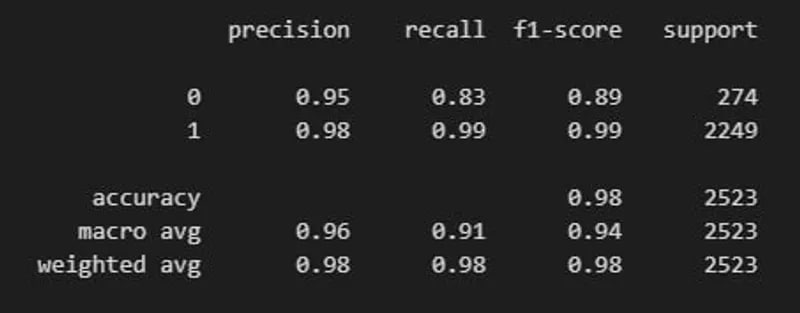
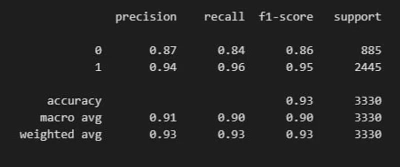
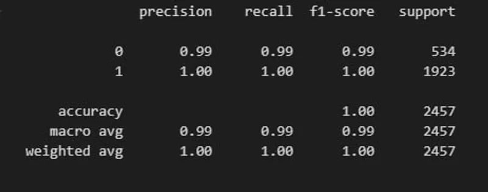

# Детектирование аномалий в работе промышленной аппаратуры на основе анализа акустической информации

## Данные

Набор данных MIMII — это надежный набор данных для исследования и
проверки неисправностей промышленного оборудования. Он содержит звуки,
издаваемые четырьмя типами промышленных машин: клапанами, насосами,
вентиляторами и направляющими. 

Каждый тип машины включает в себя несколько отдельных моделей продукта,и данные для каждой модели содержат нормальные и аномальные звуки. Чтобы напоминать реальный сценарий, были записаны различные аномальные звуки.
Кроме того, фоновый шум, записанный на нескольких реальных заводах, был
смешан со звуками машин.

Ссылка на датасет: https://zenodo.org/records/3384388#.XpNAUpnRYuV

Ссылка на шоурум: https://ba-hanseml.github.io/MIMII_show_room/showroom.html

## Предобработка

Рассмотрев статью от создателей датасета https://arxiv.org/pdf/1909.09347, мы выяснили, что звук в датасете восьмиканальный, собранный с восьми микрофонов, расположенных по кругу на расстоянии 45 градусов между друг другом. В этой же статье было приведено положение определяемых нами объектов в пространстве. Благодаря этому мы смогли найти микрофон, а соответственно и канал наиболее близкий к каждому объекту, что позволило получить лучшее качество звука и модели. 

Таким образом, клапану соответствует канал 0, насосу - 2, вентилятору - 4, направляющей - 6.

Для обучения Данные были распаршены и составлены 2 .csv файла, один включает в себя моно звук со всех микрофонов, во втором для каждого типа оборудования содержится только соответствующий ему канал.

Каждый из датасетов включает в себя следующие поля:

- db - значение децибел, при котором был записан звук
- chanel - канал, соответствующий типу оборудования
- id - идентификатор звука
- is_norm - является ли звук номальным или аномальным (1 или 0)
- file_name - название .wav файла
- mel_[i] - 40 признаков звука, выделенные с помощью мелспектрограмм
- psd_[i] - 129 признаков, выделенные с помощью спектра Уэльса

## Моделирование

В данном процессе моделирования используются 5 моделей машинного обучения для решения двух разных задач.

1. Определение вида оборудования (Equipment type Model):
Первая модель принимает на вход звуковые данные, записанные на микрофоны с различных типов оборудования. Она использует алгоритм CatBoostClassifier, чтобы классифицировать звук и определить, с какого оборудования он был записан.

2. Определение аномальности звука (Anomaly Models):
После того как первая модель определила вид оборудования, звуковые данные передаются в одну из четырех моделей (по одной на каждый тип оборудования - в данном случае клапаны, насосы, вентиляторы и направляющие). Эти модели отвечают за анализ звука на предмет аномалий. Они также используют алгоритм  CatBoostClassifier, чтобы выявить отклонения от нормального поведения звука, которые могут указывать на неисправности или другие проблемы.

## Оценка качеств полученных моделей

Метрики модели по определению типа оборудования:

Метрики модели по определению аномалии типа оборудования Valve:

Метрики модели по определению аномалии типа оборудования Pump:

Метрики модели по определению аномалии типа оборудования Fan:

Метрики модели по определению аномалии типа оборудования Slider:

